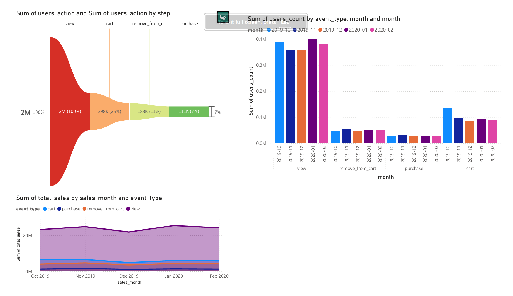

<h1>Cloud-Based E-commerce Conversion Analysis</h1>

<h3>Executive Summary:</h3>

<b>Project Goal:</b>To analyze user clickstream data to quantify conversion performance, identify the most critical user drop-off point, and assess the financial impact of purchase abandonment over a five-month period.

<b>Tools Used:</b>
<ul>
  <li>GCP BigQuery (Data Warehousing & SQL)</li>
  <li>Python/Pandas(Data Preprocessing - EDA)</li>
  <li>Power BI (Vizualization & Web Embedding)</li>
</ul>

<b>Key Finding:</b>The single greatest opportunity for immediate sales lift lies in optimizing the transition from <b>Product View to Cart</b>. Only <b>$20\%$</b> of users who view a product take the next step to add it to their cart, indicating significant friction or a lack of persuasive product information.

<h2>1. The Conversion Funnel Deep Dive</h2>

The funnel visualization clearly maps the user journey from initial engagement <b>(view)</b> to final transaction <b>(purchase)</b>. The initial volume is 2 Million user actions.

<table> 
  <thead>
    <tr>
      <th>Funnel Step</th>
      <th>User Count</th>
      <th>Conversion from previous step</th>
      <th>Percentage of Total Start</th>
    </tr>
  </thead>
  <tbody>
    <tr>
      <td><b>View</b></td>
      <td>2M</td>
      <td>N/A</td>
      <td>100%</td>
    </tr>
    <tr>
      <td><b>Cart</b></td>
      <td>3998K</td>
      <td>$\approx 20\%$</td>
      <td>25%</td>
    </tr>
    <tr>
      <td><b>Remove from Cart</b></td>
      <td>183K</td>
      <td>$\approx 46\%$ of Cart Actions</td>
      <td>11%</td>
    </tr>
    <tr>
      <td><b>Purchase</b></td>
      <td>111K</td>
      <td>$\approx 57\%$ of Final Cart Actions</td>
      <td>7%</td>
    </tr>
  </tbody>
</table>

<h2>The Bottleneck: View to Cart</h2>

The data shows a massive drop-off at the very beginning:

<ul>
  <li>2 Million users view a product.</li>
  <li>Only 398 Thousand (25% of the initial 2M, or ≈20% of viewers) add the item to their cart.</li>
</ul>

This indicates that over 80% of users who show interest by viewing a product are immediately deterred or unable to proceed.

<b>Inference:</b> This early abandonment is highly correlated with user experience issues like:

<ol>
  <li><b>Missing or unclear product information</b> (e.g., confusing size charts, poor images).</li>
  <li><b>Lack of immediate trust/social proof</b> (e.g., missing reviews, security badges).</li>
  <li><b>Ambiguity around shipping/pricing</b> that requires the user to search elsewhere.</li>
</ol>

<h2>The Second Hurdle: Cart to Purchase</h2>

While the initial drop is the biggest, the second major factor is Cart Abandonment.

<ul>
  <li>Users who reach the cart stage: 398K.</li>
  <li>Users who explicitly remove_from_cart: 183K.</li>
  <li>Users who successfully purchase: 111K.</li>
</ul>

This indicates that 46% of total Cart actions result in the user actively removing the item, and only 28% of cart actions result in a purchase. This points to friction in the checkout process (e.g., unexpected fees, forced account creation).

 
<h2>2. Sales Trend Analysis</h2>

The lower visualization tracks the Sum of total sales (the bulk of which appears to be purchase events) from October 2019 to February 2020 .

<ul>
  <li>Total Sales hover around 20M across the analyzed months.</li>
  <li>Sales peaked in November 2019 , followed by a dip in December 2019 , and a strong recovery/new peak in January 2020.</li>
</ul>

<b>Inference:</b> The sales trend confirms the business seasonality (potential Q4 holiday spike in Nov/Dec, followed by post-holiday recovery in Jan). However, the consistently low overall conversion rate of 7%  across the entire funnel suggests that optimization efforts will yield high returns regardless of seasonal fluctuation.

 
<h2>3. Actionable Recommendations</h2>

Based on this analysis, the business should prioritize the following actions to immediately lift the 7% conversion rate:

<ol>
  <li></li><b>Prioritize Product Page Optimization (View → Cart): </b>Run A/B tests on product pages focusing on:
    <ul>
      <li><b>Visibility of Shipping/Returns Policy</b> (above the fold).</li>
      <li><b>Enhanced Image Quality and Video Demos.</b></li>
      <li><b>Prominent Placement of User Reviews/Social Proof.</b></li>
    </ul>
  </li>
  <li><b>Optimize the Checkout Flow (Cart → Purchase):</b>
    <ul>
      <li>Reduce explicit remove_from_cart events by auditing the checkout process for unexpected fees or mandatory friction points.</li>
      <li>Implement <b>Guest Checkout</b> options.</li>
    </ul>
  </li>
</ol>

By addressing the 80% drop-off between View and Cart, the e-commerce platform can significantly increase the volume of users entering the final high-conversion stages, leading to a substantial lift in the multi-million dollar sales base.

 
<h2>POWER BI DashBoard Image:</h2>
DashBoard Image
<h2>Ecom Live Dashboard:</h2>

<iframe title="Ecom_clickstream" width="600" height="373.5" src="https://app.powerbi.com/view?r=eyJrIjoiMDNhM2U5YTAtMzhmMS00NDQ3LWIyZDItOTc5ZWYxZWQ1YjAzIiwidCI6IjFjZGYzNGYzLTA4ZjktNDNlYi05ZDRmLTJiYTRhMWQyMGE2ZiJ9" frameborder="0" allowFullScreen="true"></iframe>

